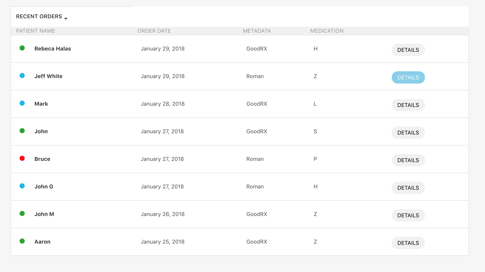

## TruePill Test Comments

### To run the app

Run 'yart start:client' in terminal while inside the my-code folder.s

### Main challenges

* I found setting up the React environment (to simply render Hello World within the react App) the most challenging part.

### Unfinished parts

* I gave myself an hour and a half to do this and no more. I struggled with getting the border to go the whole way around the table - usual tricks not working to solve this. I'm sure it would be an easy fix with a bit of re arranging but I ran out of time and thought it was better not to go over. Other than that, I feel like the rest of it was ok and not too challenging!

### If I had more time
I would have liked to get the spacing between elements more accurate and include some SCSS variables to make my code more DRY.

### Final Product

  

